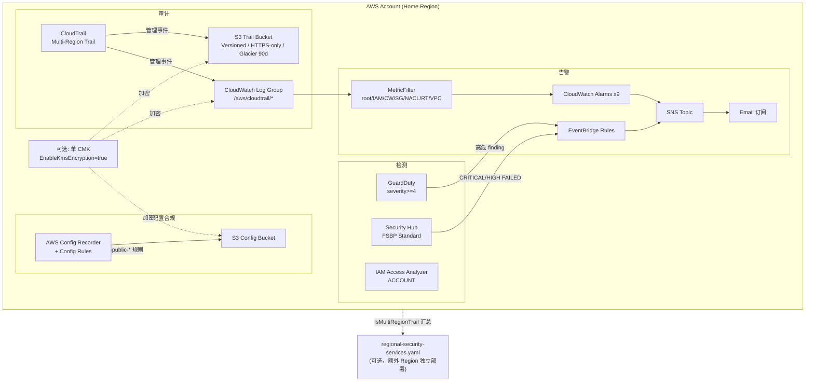

# 架构文档

## 目标

为新开通的 AWS Global 账号建立最小成本、可重跑的安全基线：让所有管理操作可审计、异常行为可检测并触发邮件告警、关键配置项可持续合规检查，验证单账号场景下用 CloudFormation 一次部署即可覆盖 CIS/FSBP 核心检查项，定位为"最小可行安全起点"而非 Control Tower / 生产级 Landing Zone 的替代品。

## 组件

- **审计**：CloudTrail（`IsMultiRegionTrail=true`、日志完整性校验）→ S3 Trail Bucket（加固）+ CloudWatch Logs
- **检测**：GuardDuty（`FIFTEEN_MINUTES` 发布频率）、Security Hub（仅启用 FSBP 标准）、IAM Access Analyzer（`ACCOUNT` 类型）
- **配置合规**：AWS Config Recorder + Config Rules（root MFA、S3 公开访问等）→ S3 Config Bucket
- **告警**：CloudWatch MetricFilter（对 CloudTrail 日志）+ 9 条 CloudWatch Alarm（root 使用、IAM/网络变更等）→ SNS Topic → Email；GuardDuty/Security Hub 的高危 finding 经 EventBridge 规则转发到同一个 SNS Topic
- **S3 防护**：日志桶与 Config 桶均 `BucketOwnerEnforced`、账号级 Block Public Access、HTTPS-only 桶策略、Versioning、90 天转 Glacier
- **身份**：IAM 密码策略（14 位、90 天、24 次复用限制，脚本设置，非 CFN 资源）
- **可选增强**：单 CMK（`EnableKmsEncryption=true`）加密 CloudTrail S3/Config S3/CloudWatch Logs；`regional-security-services.yaml` 向额外 Region 扩展 GuardDuty/Security Hub/Config/Access Analyzer；`MONTHLY_BUDGET_AMOUNT` 开启预算告警
- **部署方式**：CloudFormation（`cloudformation/security-baseline.yaml` 为 Home Region 主基线，`regional-security-services.yaml` 为多 Region 扩展），`scripts/deploy.sh` / `scripts/enable-regional-services.sh` 幂等部署

## 架构图

CloudTrail 以 Multi-Region Trail 采集全账号管理事件，同时写入 S3 Trail Bucket（长期归档）和 CloudWatch Log Group（供实时告警）。CloudWatch 的 MetricFilter 从日志中提取 root 使用、IAM 策略变更等 9 类事件，触发 Alarm 后统一发布到 SNS Topic 并邮件通知；GuardDuty 中高危 finding 和 Security Hub 的 FAILED 检查项也通过 EventBridge 转发到同一 Topic，形成统一的"检测 → 告警 → 邮件"路径。AWS Config 持续记录资源配置快照并跑合规规则，结果写入独立的 Config S3 Bucket。

多 Region 场景下，`regional-security-services.yaml` 在额外 Region 独立部署 GuardDuty/Security Hub/Config/Access Analyzer，CloudTrail 的 Multi-Region 特性确保管理事件仍集中汇总到 Home Region。

## 关键设计决策

- **CloudFormation 而非 CDK/Terraform**：定位"开箱即用"，目标用户是刚开通账号的工程师，任何有 AWS CLI 的环境可直接跑，不引入语言运行时或状态文件管理。
- **日志桶不设过期删除**：审计日志删除可能违反 SOC 2 / PCI-DSS 等保留要求，只做 90 天 Glacier 转换降本，不自动删除。
- **S3 账号级 PAB 和 IAM 密码策略用脚本而非 CFN**：这两项是账号级设置，CFN 无原生资源类型覆盖（如不存在 `AWS::IAM::AccountPasswordPolicy`），`delete-stack` 不会撤销，需手工清理。
- **GuardDuty 告警阈值 severity>=4**：过滤掉低危信息性 finding，避免告警疲劳。
- **Security Hub 只启用 FSBP**：不开 `EnableDefaultStandards`，避免自动开启不一定适用的 CIS v1.4 等标准。
- **SNS 本身不加密**：邮件通知场景加密收益有限，且会引入额外 KMS 调用延迟；如需加密统一走可选的单 CMK 方案（覆盖 CloudTrail S3 / Config S3 / CloudWatch Logs）。
- **幂等部署**：`set -euo pipefail` + `--no-fail-on-empty-changeset`，部署前探测 GuardDuty/Security Hub/Access Analyzer 是否已存在，避免重复创建报错。

## 不覆盖范围

多账号集中治理（Organizations + Control Tower）、集中日志归档、细粒度权限治理（IAM Identity Center）、网络分层隔离（VPC + TGW + Network Firewall）、自动修复（Security Hub Action + Lambda）、漏洞管理（Inspector）、数据分类（Macie）、SIEM（Security Lake + OpenSearch）均超出本基线范围，需单独规划。
